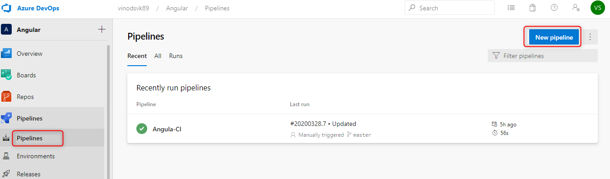
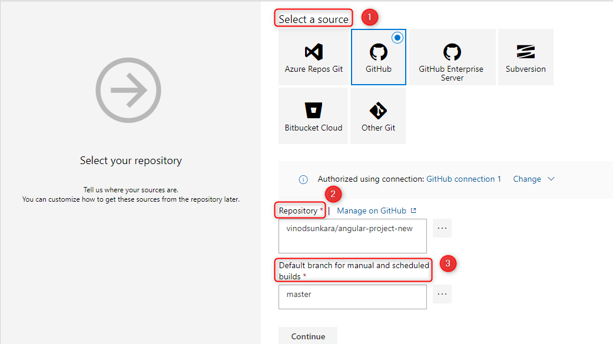
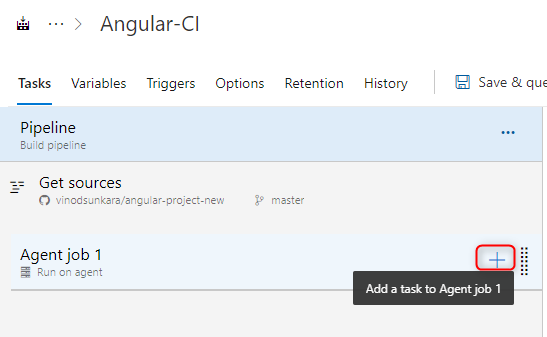
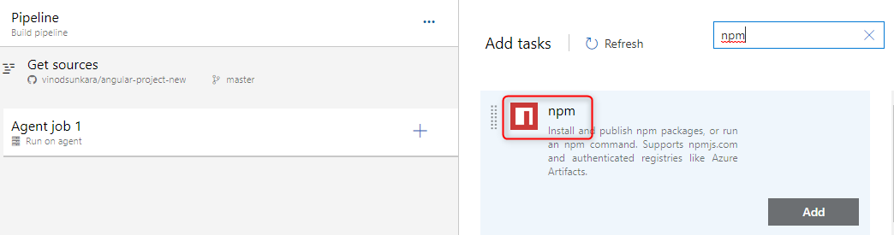
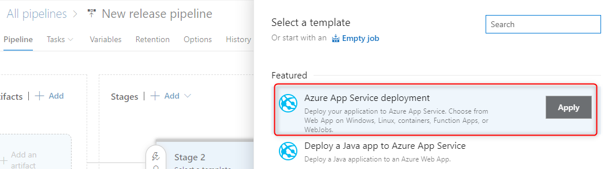
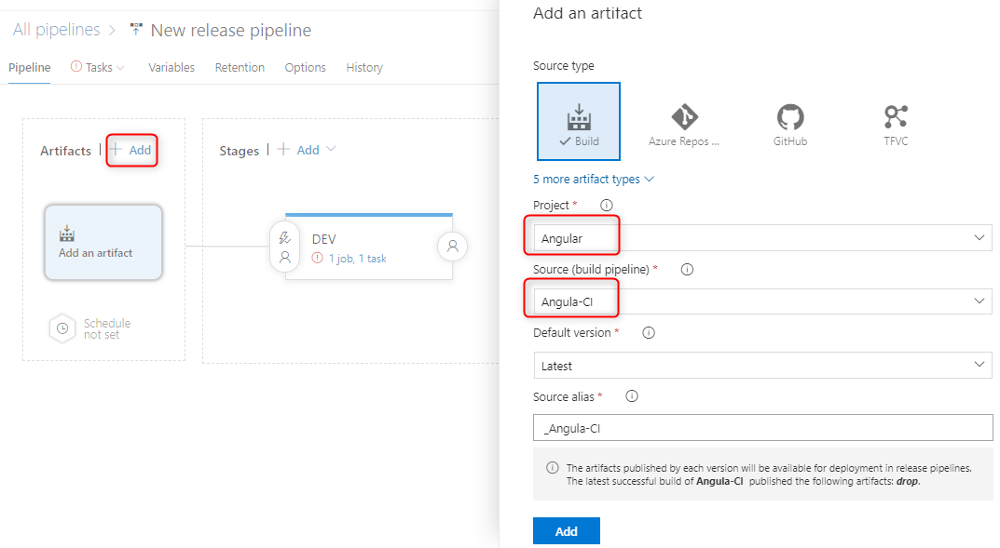
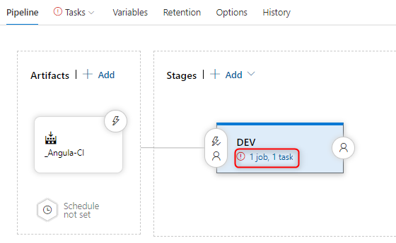
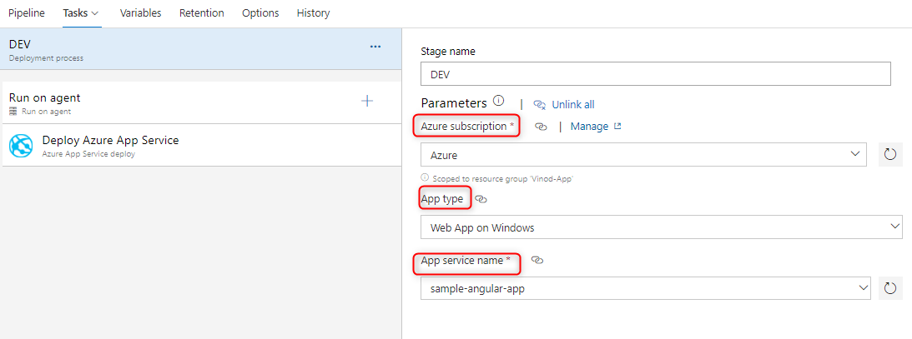

## Create a VSTS CI/CD pipeline for an Angular Application 

### CI Pipeline for an Angular Application

* Select the **Pipelines** from the left side menu in your project and click on the **New Pipeline** button.

 

* Select the ***Use the classic editor*** to create a pipeline
* Select the Source, Repository and the branch from which you want the application to build and click ***Continue***

 

* Select the empty job option at the top.
* Now add a task as shown below.

 

* Search for `npm` and then add the npm task to the pipeline

 

* Click on the newly-created npm task and under the command, select `Install` and configure the Working folder that contains package.json
* Right click on the `npm` task and select ***Clone task(s)*** to create a similar task
* This time select the custom option for command and rename the task to `npm build`
* In the Command and arguments use  `run build`  or if you are using `--prod` then use `run build-prod` based on your package.json of your application. 
* Configure the Working folder that contains package.json for `npm build` task as well.
* Add another task and search for `Archive files`. This task is use to create an archive file from a source folder.
* In the `Root folder or file to archive` use `$(System.DefaultWorkingDirectory)/dist/project-name` ***(replace the "project-name" with your project name)***
* ***$(System.DefaultWorkingDirectory)*** is basically a local path on the agent where your source code files are downloaded and compiled (Example: c:\agent_work\1\s)
* Add the last task by searching for **publish** and add the task **Publish build artifacts** from the list of available options. In this task, you do not need to modify are configure anything.
* The final output of the pipeline looks like below

 

* Now use the **Save & Queue** button.

### CD Pipeline (Deploying an Angluar application to the Azure App Service)

* First, please log into you Azure Portal and create a new Web App with a name of your choice.
* Select **Releases** and from the left side menu in your project and click on the **New Release Pipeline** 
* Select **Azure App Service Deployment** template and click Apply to get our artifact and drop it to Azure

 

* Select **Add an artifact** to configure the CI pipeline connection
* Artifact is basically a .zip (compilation of your code) file which we created in CI pipeline.
* So as a source we will select the build definition which produces the artifact as an output.

 

* If you click on the **1 job, 1 Task** link it will redirect you to a page where we can take a closer look on what should be done with the artifact. 

 

* Configure all the Azure Details (Subscription, app type, and app service name)

 

* Click **Save & Queue** to trigger the build deployment.